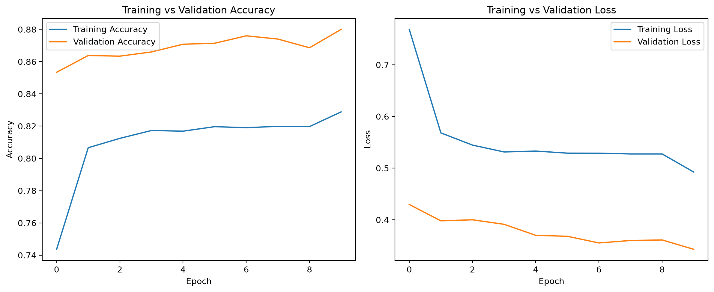
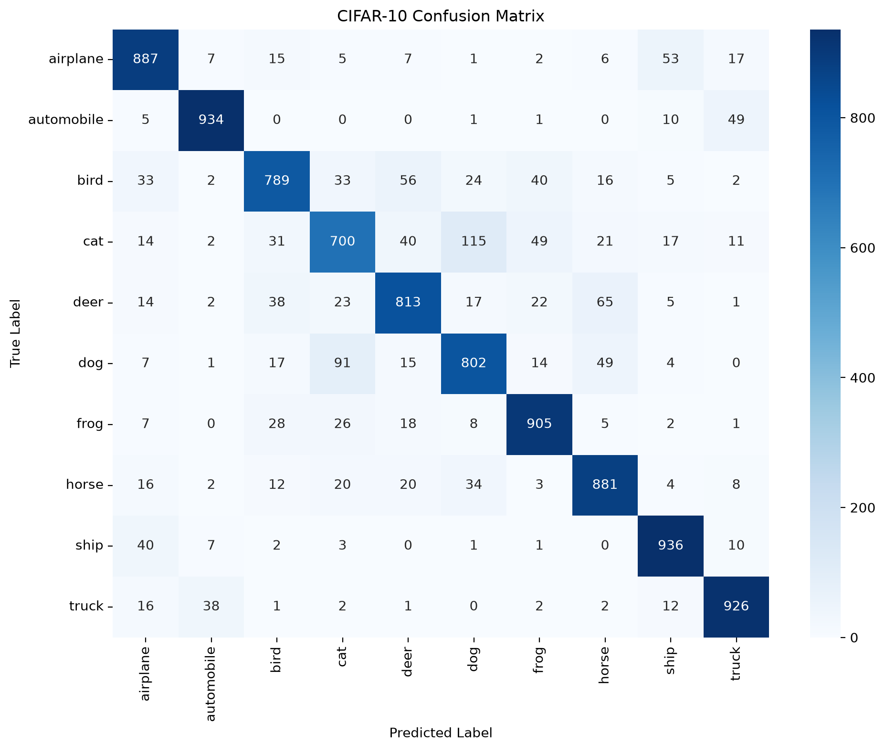
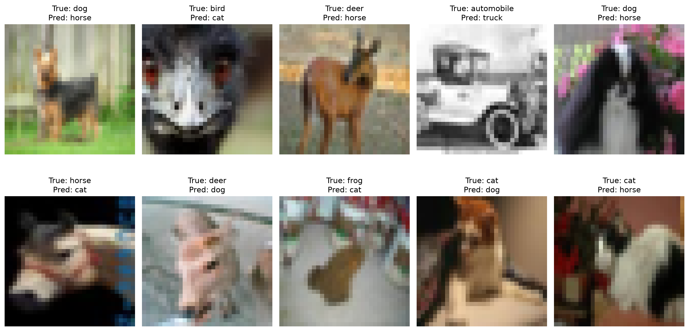

# CIFAR-10 Image Classification using Transfer Learning

## Project Overview

This project classifies CIFAR-10 images into 10 categories using transfer learning with a pretrained MobileNetV2 model.

The MobileNetV2 backbone was pretrained on ImageNet and kept frozen. A small classification head was added for CIFAR-10 classification.

## Dataset

CIFAR-10 contains 10 image classes:

- airplane
- automobile
- bird
- cat
- deer
- dog
- frog
- horse
- ship
- truck

The original CIFAR-10 images are 32 × 32 RGB images.

Dataset split used in this project:

- Training: 45,000 images
- Validation: 5,000 images
- Test: 10,000 images

The test set was kept separate from training and validation.

## Model

### Backbone

- MobileNetV2
- ImageNet pretrained weights
- `include_top=False`
- Frozen backbone

### Classification Head

- Global Average Pooling
- Dropout (0.3)
- Dense layer with 10 outputs
- Softmax activation

### Input

Images were resized/cropped to 96 × 96.

## Data Augmentation

The training pipeline uses:

- Random horizontal flipping
- Random cropping

Validation and test data use deterministic preprocessing without random augmentation.

## Training

The model was trained using:

- Optimizer: Adam
- Initial learning rate: 0.001
- Batch size: 64
- Maximum epochs: 10
- Early stopping
- ReduceLROnPlateau

Training was performed using TensorFlow with an NVIDIA RTX 4060 through WSL2.

## Results

Final test performance:

| Metric | Result |
|---|---:|
| Test Accuracy | **85.73%** |
| Test Loss | **0.4132** |
| Macro F1-score | **0.8563** |
| Weighted F1-score | **0.8563** |

The model achieved more than the required 80% test accuracy.

## Class-wise Performance

The strongest classes were automobile, ship, truck, and frog.

The weakest class was cat, which showed notable confusion with dog and other animal categories.

The confusion matrix also shows that animal classes such as cat, dog, deer, and horse are harder to distinguish than visually distinct vehicle classes.

## Misclassified Examples

Ten misclassified test images are included in the notebook.

Common reasons for errors include:

- Low image resolution
- Similar shapes between animal classes
- Similar vehicle appearances
- Difficult poses or backgrounds
- Limited fine-grained visual information

## Project Structure

```text
CUsersYourNameDesktopcifar10-transfer-learning/
│
├── models/
│   └── cifar10_mobilenetv2_transfer_learning.h5
│
├── notebooks/
│   └── cifar10_transfer_learning.ipynb
│
├── results/
│
├── screenshots/
│
└── README.md

## Results Visualizations

### Training Curves



### Confusion Matrix



### Misclassified Examples



## Reflection

Transfer learning with a frozen MobileNetV2 backbone provided strong performance while keeping the number of trainable parameters very small. The model achieved **85.73% test accuracy**, exceeding the required 80% target.

The main challenge was distinguishing visually similar animal categories, particularly cat, dog, deer, and horse. The confusion matrix and misclassified examples show that low-resolution images and similar shapes/backgrounds contribute to these errors.

A possible improvement would be fine-tuning some of the deeper MobileNetV2 layers after the initial frozen-backbone training, which may improve class-specific feature learning.
